# Code Institute Milestone Project 1 by JP

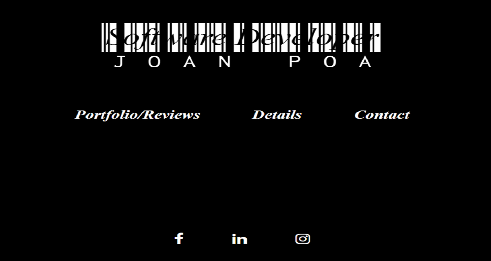

---

## **INDEX:**

---

- **Introduction**
- **UX Design**
- **Website Setup**
- **Technologies used**
- **Testing**
- **Images**
- **Deployment and Publishing**
- **Acknowledgements**
- **Final words**
 ---

## **INTRODUCTION**

---

This site is my first milestone project for my course provider - Code Institute. This website is an online fake persona resume with the goal not to be generic, to stand out and present all the information required in a creative way to my target audience - **Recruiters** and ultimately be hired.  

---

## **UX DESIGN** 

---
I found the following links from recruiters (my target audience) describing the best 35 personal websites ever viewed and the best resume format:

https://www.themuse.com/advice/the-35-best-personal-websites-weve-ever-seen

https://www.myperfectresume.com/how-to/2018-best-resume-formats-according-to-recruiters

I used this as a baseline to create my website's first wireframe (an example of the index page).  

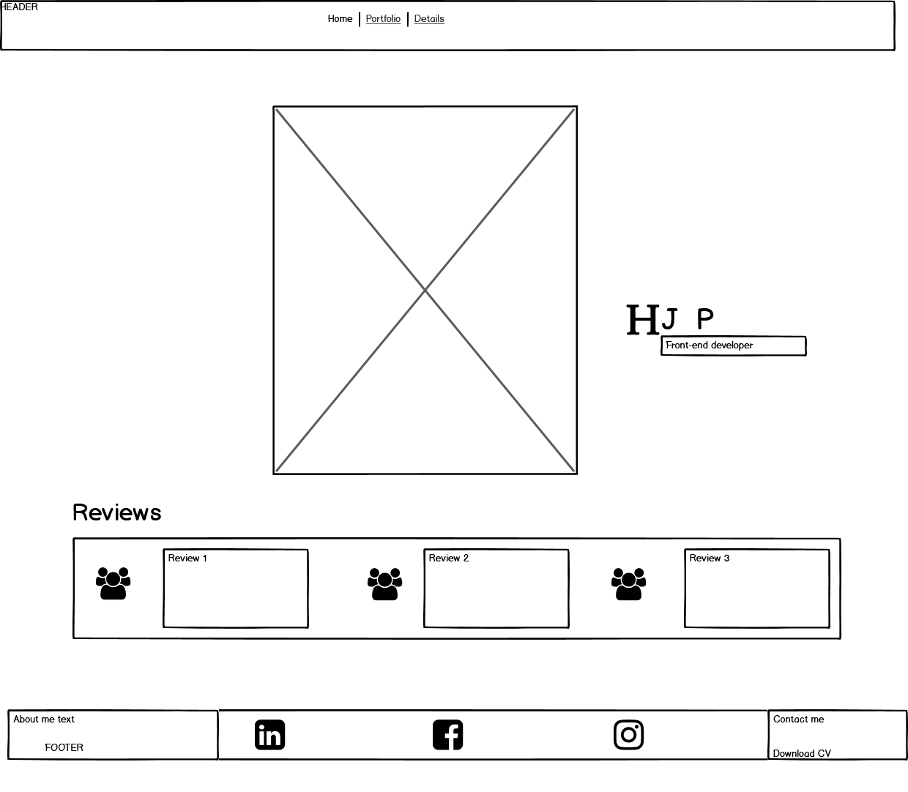

Through the UX design process my website evolved and changed after reviews from my peers and mentor.  

*User story* - The biggest change to my website was an interview Code Institute had on SoundCloud with a recruiter, the recruiter spoke about images of an applicant being used and resume setups.  I immediately removed images of the fake applicant and decided on a very minimal color scheme and eye catching Google fonts.  The interview is available here - https://soundcloud.com/codeinstitute/crafting-the-perfect-developer-cv.

An example of the index page after the interview of my target audience.

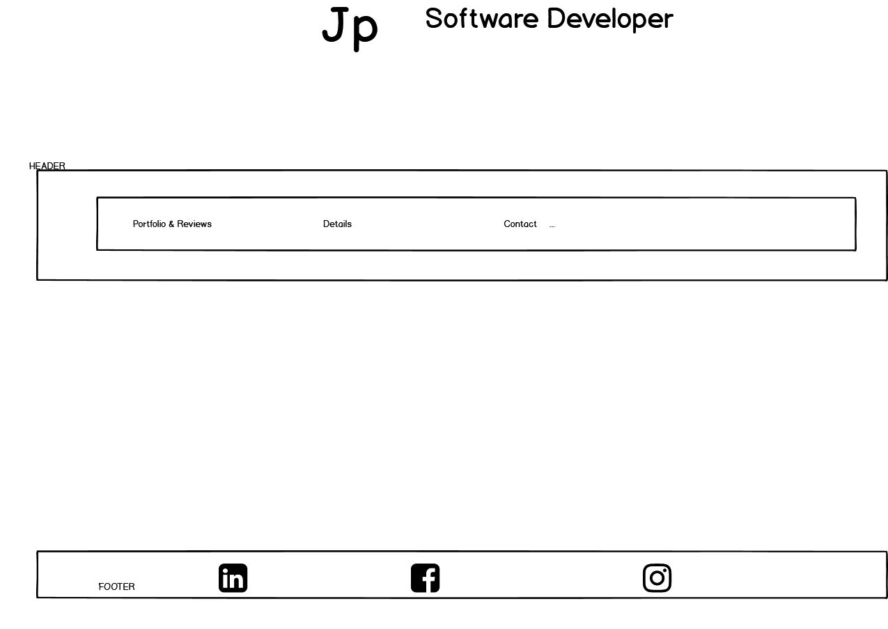

---

## **WEBSITE SETUP**

---

### **Index/Home page**: 

**Setup** - Main title with animation, navigation bar underneath it with links to 3 pages and in the footer 3 social links. 

**User experience setup** - The main title is a very strong font with animation in the center of the page to draw the attention of the user immediately.  I placed the navigation underneath that so the user does not need to look for the links to the portoflio, personal details or contact page.  It is common practice to place social links on the index page in the footer. The footer links spin when you hover on them, other websites' social icons tend to be static. The colour theme is black and white, strong fonts, main contents always centered in the middle of the page.

### **Portfolio and reviews page**: 

**Setup** - Header has thr title of the page and a closing tab to the Index/Home page far right. Main contents are a Carousel with images of projects and reviews. Below in the footer 3 sections - about me column, social links column, download CV pdf column. 

**User experience setup** - The header is the same font as the main title (continuity), which shows the user which link they are in. The closing tab has a tooltip which pops up when you hover over it to show the user that the tab will return to the home page.  The closing tab also scales up when hovered over it to ensure the user sees the tooltip. It is common practice that a closing tab is always on right side top of a page. I decided to the remove the navbar and use a closing tab instead as the look of the page was too much. The main contents just like the Home page is a section with movement. The user can use the scrolls to move from one image to another. The scrolls are an off orange colour (which increase colour intensity when hovered on) to emphasize and show the user where to click. The caption below the images have messages to encourage the user to click and view the links separately. To ensure continuity, like the Home page, the colour theme continues. Below the main contents, 3 items again. However now the footer is divided into 3 columns in a smaller font to convey more information to the user.

### **Details page**: 

**Setup** - Header has a title of the page and a closing tab to the Index/Home page. (This is a resume page based on the information that is also available on the donwloadable CV). The main contents is information which is separated into accordions in 3 columns. The middle section is animated initials of the applicant.  Below in the footer- about me column, social links column, download CV pdf column. 

**User experience setup** - The header is the same font as the main title (continuity), which shows the user which link they are in. The closing tab is the same setup as on the Portfolio and Reviews page. The main contents is accordions, the user clicks on the titles, information collapses down and closes when clicked on the title again or another title. I wanted to separate the information to ensure that there was not too much information on the page which might overwelm the reader/user. The middle column is animated initials of the applicant with a strong font to draw the attention of the user to the middle of the page, ensuring that the user will see the accordion tabs next to it. There are also arrow icons to indicate a link to click on (continuity same off orange colour as the scroll icons from the carousel). Continuity the icons rotate similar to the social links icons in the social footer but with lesser degree. To ensure continuity like the Home page, the colour theme continues. Below the main contents, again 3 items. The footer is the same format as on the Portfolio and Reviews page.

### **Contact me page**: 

**Setup** - Header has a title of the page and a closing tab to the Index/Home page. The main contents is an e-mail form to send a message to the applicant. NOTE: This form is not connected to an e-mail server, I still have to learn how to do this in the course.  Below in the footer- about me column, social links column, download CV pdf column. 

**User experience setup** - The header is the same font as the main title (continuity), which shows the user which link they are in. The closing tab is the same setup as on the Portfolio and Reviews page. The main contents is a form to be filled in by the user. To ensure that the user does not have a bad experience by filling in the form only to discover upon submission that it does not work and receives a 500 error, I have used a modal pop-up message to inform the user to click on this button first, informing the user the service is unavailable and alternative ways to contact the applicant. To ensure continuity, like the Home page, the colour theme continues. Below the main contents, again 3 items. The footer is the same format as on the Portfolio and Reviews page.

**Note** -  *Mobile phones and tablets*

On mobile devices the footer only displays one of the columns on the Portfolio, Details and Contact me pages.  I have rotated them so the mobile user will be able to read all the footer 
sections, unlike the desktop user which sees all 3 columns displayed in the footer  all the time.
For continuity between the pages the following main contents layout is followed:
* Index page - 1 column
* Second page - Square
* Third page - 1 column
* Fourth page - Square

*Downloadable pdf CV*, continues the colour theme of black, white and off orange. It is also designed to stand out and not be generic.

**Future features** - 
1. To connect a database to the form page and receive e-mails from the users.  
                      
2. In the event that another developer needs to use this project, I left uncommented codes on the Contact me html page: where the e-mail server should be connected, where the modal must be removed or uncommented in the events of the service becoming unavailable in the future and to change the submit button text back to 'send'.

3. When I have more experience in JavaScript, Python, (etc), I want to create a separate page for coding and contributions.

4. The tablet design orientation is based on reading a book (vertical). I would like to add screen rotation, so when the user opens the website on a tablet it is viewable landscape or portrait.

5. As I continue my studies, there will always be room for improvement and as such this project will continue to grow and upgrade.

---

## **TECHNOLOGIES USED**

---

**1.** HTML5: Language used to create web pages. https://developer.mozilla.org/en-US/docs/Web/HTML

**2.** CSS3: Language used to make the website look appealing.
https://www.w3.org/Style/CSS/Overview.en.html

**3.** Bootstrap: The world’s most popular framework for building responsive, mobile-first sites. I used a few of its features to create this website for example: carousel, accordion, fixed-top, fixed-bottom, img-fluid, navbar collapse/expand, form, modal, close icon, rows, columns, containers, displays. https://getbootstrap.com/

**4.** Gitpod: An online IDE ready-to-code dev environments
for your GitHub or GitLab project with a single click.. https://www.gitpod.io/

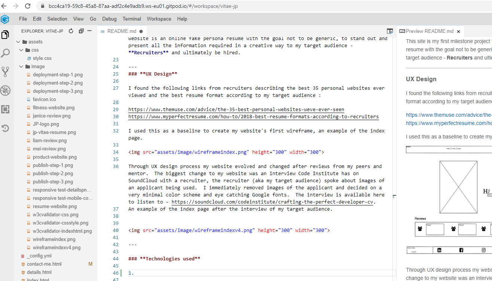

**5.** Git: It is a distributed version-control system for tracking changes in source code during software development in Gitpod. https://git-scm.com/

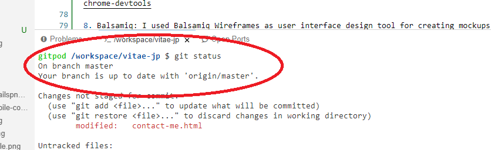

**6.** GitHub: It offers the distributed version control, that means that coders can share, collaborate and view their codes ( in my case with my mentor). https://github.

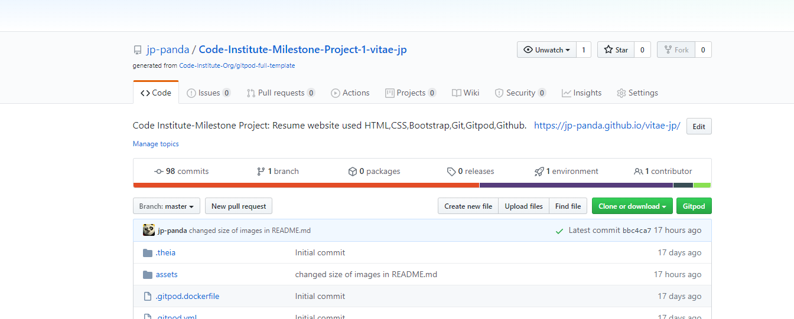

**7.** Chrome DevTools: It is a web developer tool built directly into the Google Chrome browser. I used this tool to view display on different devices, identify the elements name which I wanted to change in my CSS style page. https://developers.google.com/web/tools/chrome-devtools

**8.** Balsamiq: I used Balsamiq Wireframes as user interface design tool for creating mockups or low-fidelity prototypes of my website. https://balsamiq.com/

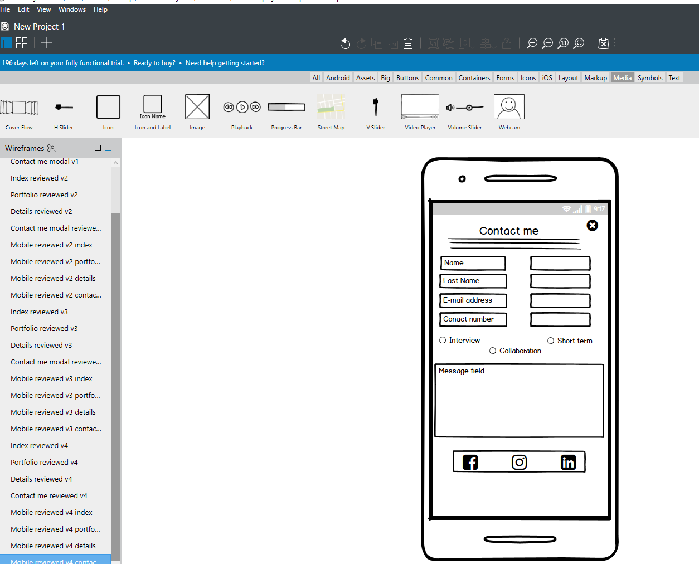

**9.** Gimp: Is a free and open-source raster graphics editor used for image retouching and editing, free-form drawing, converting between different image formats, and more specialized tasks. I used it to change coloured images to white and black. https://www.gimp-page.org/

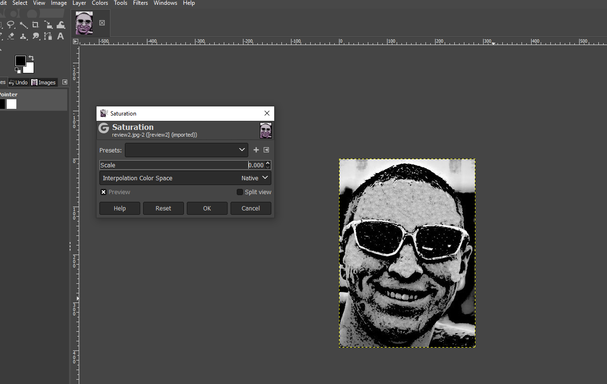

**10.** MS Paint:  Built-in application is Windows which I used to resize images to 1280px to 640px.

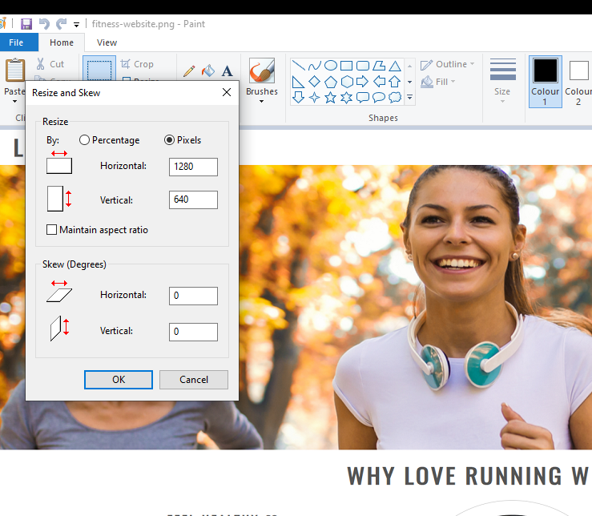

**11.** Font Awesome: I used this website for all my icons. https://fontawesome.com/

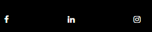

**12.** Google Fonts:  I used this website for my font styles. https://fonts.google.com/

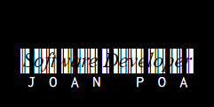

---

## **TESTING**

---

**1.** W3C Markup Validator: I used it to check all my html pages (4) were error free. https://validator.w3.org/ 

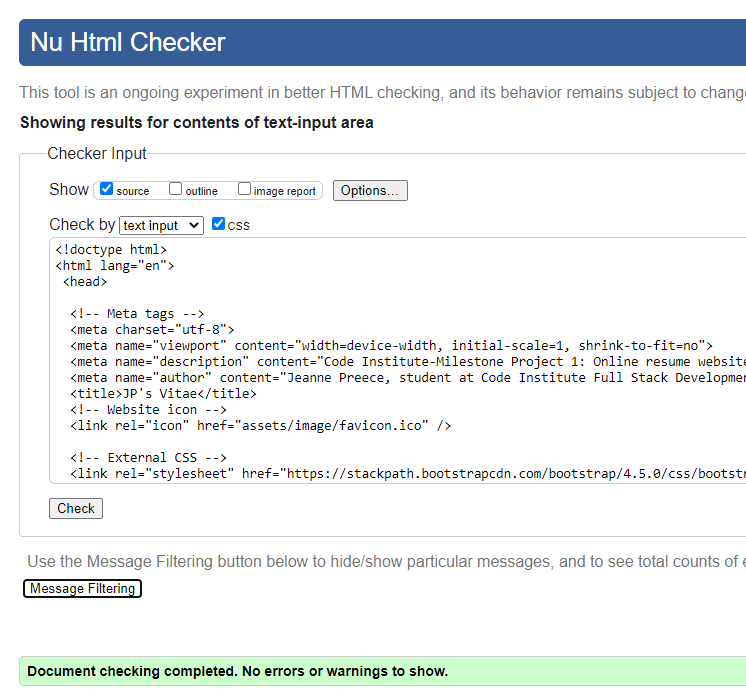

**2.** Jigsaw CSS Validor: I used it to check that my CSS style page was error free. https://jigsaw.w3.org/css-validator/validator

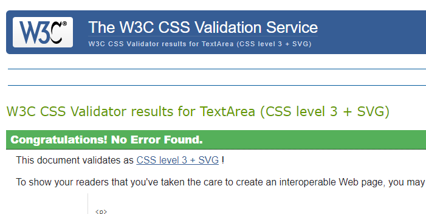

**3.** Ami Responsive Design: I used this to ensure that my website was responsive on all devices. http://ami.responsivedesign.is/ 

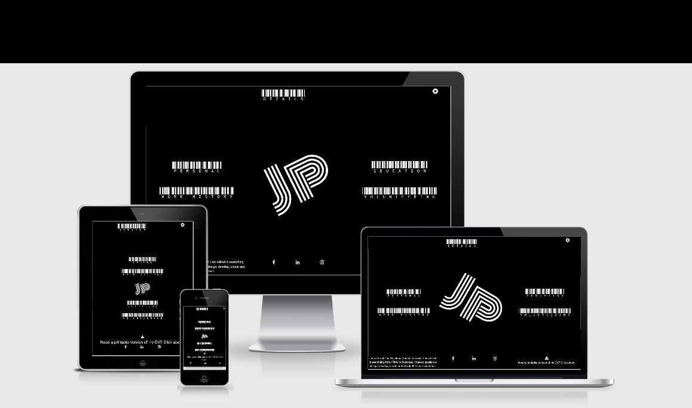

**4.** Manual testing - 
* All links and buttons were tested one at a time manually.
* The published website was manually tested on ~
  * IPhone 
  * Tablet (vertical layout like reading a book)
  * Laptop
  * Desktop
---

## **IMAGES**

---

The images I used are from Code Institute's project Love Running. 
I do not own these images, it was used for educational purposes.

http://codeinstitute.s3.amazonaws.com/FundamentalsProjects/HTML-CSS/formbg.jpg
https://codeinstitute.s3.amazonaws.com/FundamentalsProjects/HTML-CSS/video-mask.png
https://codeinstitute.s3.amazonaws.com/FundamentalsProjects/HTML-CSS/man.jpg

---

## **DEPLOYMENT & PUBLISHING**

---

**1.** I signed up for a Github account.

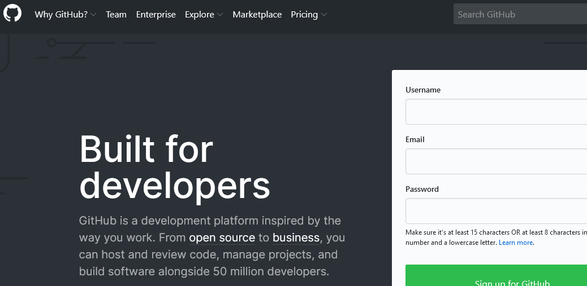

**2.** I searched for the Code Institute template and clicked on use this template.

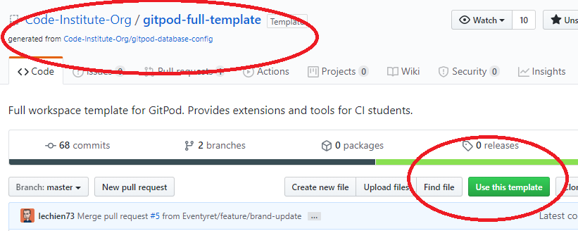

**3.** I added a name to the new repository.

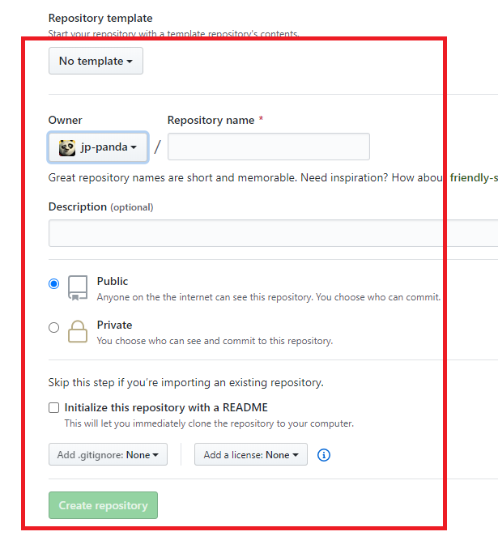

**4.** After I created the repository, I add a topic to explain what the project is about and click the Settings tab. 

**5.** I scroll down to the Github pages section, select the master branch on the scroll menu and add a theme.  NOTE: If you do not select a theme it will not open in Gitpod. 

**6.**  I add Gitpod as an extension to my Github account.  (NOTE - the display says Remove from Chrome because I have already added it, it will say Add instead if you are new.)

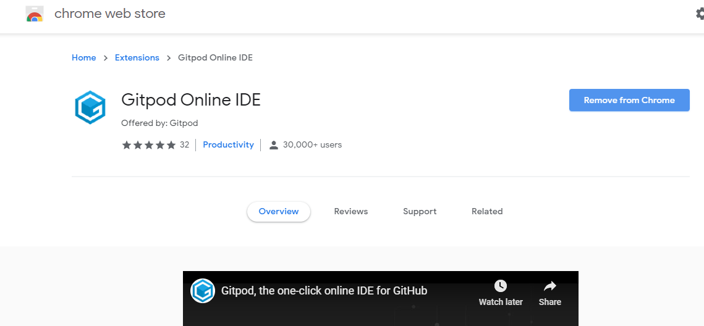

**7.**  I open the newly created repository in Gitpod.

**8.** Click on Gitpod, create website, use git to add, commit and push to Github. Return to Github's settings section, scroll down to Github pages section and your website has a published address to view on the web.

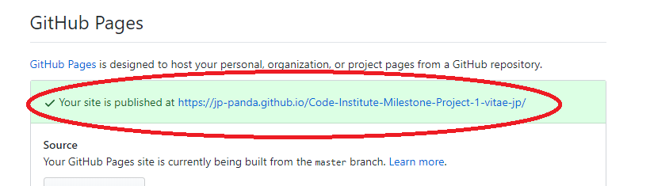

**9.** To view or use the code, return to the code tab (first in list) and select
Clone/Download.  Open on your desktop or download zip file for this project.

---

## **ACKNOWLEDGEMENTS**

---

1. The StackOverflow community with helping with vertical alignment. 
https://stackoverflow.com/questions/42187838/how-to-vertically-center-a-div-on-page
    
    And a shout out to https://stackoverflow.com/users/3588080/phuwin, who had an issue similar to mine. Bootstrap 4's accordion example has 3 accordion tabs, I added a fourth. The third tab never collapsed when another tab was clicked. It was frustrating as only 3 of the 4 accordions behaved correctly. This stackoverflow user, phuwin, figured it out by using Javascript. https://stackoverflow.com/questions/42413244/accordion-doesnt-work-in-bootstrap-4-collapse. I hope after gaining more experience I will be able to address why this issue needed a jquery to correct.

2. This website help me identify which card elements to use in the accordion card header buttons with icons to rotate. Never used the .fa class before, always the icon elements. I wanted the icons to rotate differently on the left side to right side.
https://disjfa.github.io/bootstrap-tricks/card-collapse-tricks/

3. The Code Institute's projects':
    * Love Running
    * Whiskey Drop
    * Rosie Odenkirk resume,
    
    which really created the foundation for this website. https://codeinstitute.net/

4. My mentor - Adegbenga Adeye, who really gave good advice about utilizing Bootstrap. (My mentor caught that the accordion was not behaving properly, none of my peers caught it). 
https://ng.linkedin.com/in/adegbenga-adeye-14003635

---

## **FINAL WORDS**

---
## **"That's all, coders!"**

---