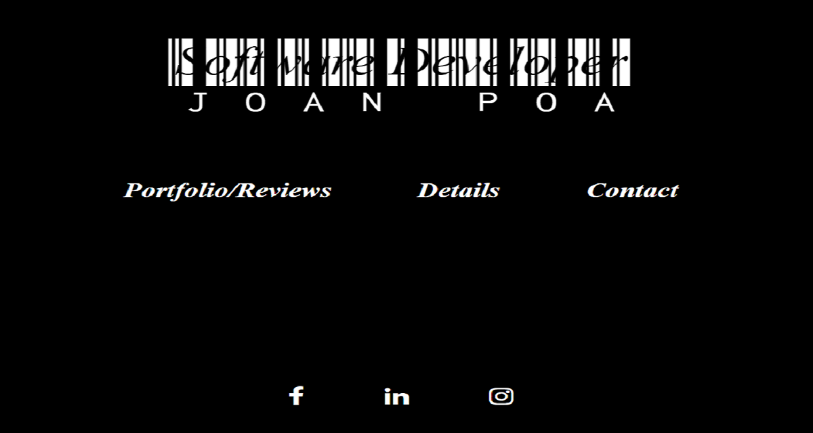
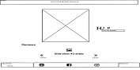
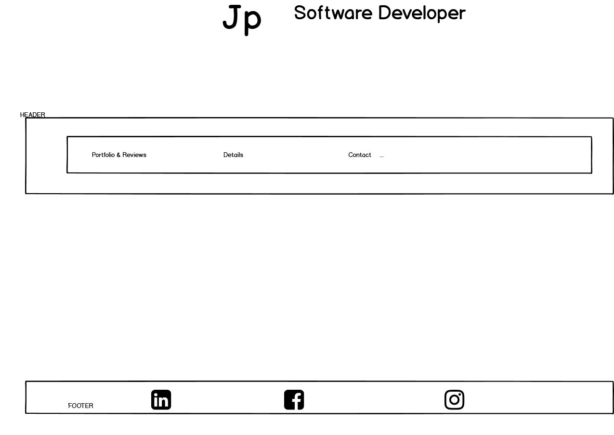

# Code Institute Milestone Project 1 by JP

## **Index:**

- **Introduction**
- **UX Design**
- **Technologies used**
- **Testing**
- **Images**
- **Acknowledgements**
- **Deployment**
- **Publishing**
 - **Future plans for Project**
 ---

### **INTRODUCTION**

This site is my first milestone project for my course provider - Code Institute. This website is an online fake persona resume with the goal not to be generic, to stand out and present all the information required in a creative way to my target audience - **Recruiters** and ultimately be hired.  

---
### **UX Design** 

I found the following links from recruiters describing the best 35 personal websites ever viewed and the best resume format according to my target audience :

https://www.themuse.com/advice/the-35-best-personal-websites-weve-ever-seen
https://www.myperfectresume.com/how-to/2018-best-resume-formats-according-to-recruiters

I used this as baseline to create my website's first wireframe, an example of the index page.  

Through UX design process my website evolved and changed after reviews from my peers and mentor.  The biggest change to my website was an interview Code Institute has on SoundCloud with a recruiter, the recruiter (aka my target audience) spoke about images of an applicant being used.  I immediately removed images of the applicant and decided on a very minimal color scheme and eye catching Google fonts.  The interview is available here to listen to - https://soundcloud.com/codeinstitute/crafting-the-perfect-developer-cv.
An example of the index page after the interview of my target audience.

---

###

