# Code Institute Milestone Project 1 by JP

---

**Index:**

---

- **Introduction**
- **Website Setup**
- **UX Design**
- **Technologies used**
- **Testing**
- **Images**
- **Deployment and Publishing**
- **Acknowledgements**
- **Final words**
 ---

**INTRODUCTION**

---

This site is my first milestone project for my course provider - Code Institute. This website is an online fake persona resume with the goal not to be generic, to stand out and present all the information required in a creative way to my target audience - **Recruiters** and ultimately be hired.  

---

**UX Design** 

---
I found the following links from recruiters describing the best 35 personal websites ever viewed and the best resume format according to my target audience :

https://www.themuse.com/advice/the-35-best-personal-websites-weve-ever-seen
https://www.myperfectresume.com/how-to/2018-best-resume-formats-according-to-recruiters

I used this as a baseline to create my website's first wireframe (an example of the index page).  

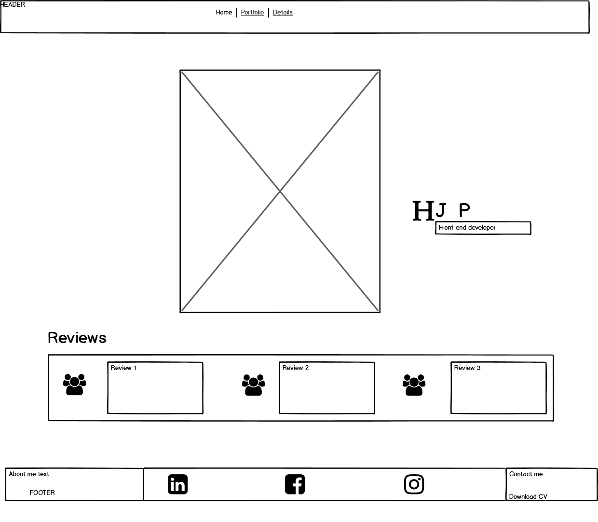

Through UX design process my website evolved and changed after reviews from my peers and mentor.  The biggest change to my website was an interview Code Institute had on SoundCloud with a recruiter, the recruiter (aka my target audience) spoke about images of an applicant being used.  I immediately removed images of the fake applicant and decided on a very minimal color scheme and eye catching Google fonts.  The interview is available here - https://soundcloud.com/codeinstitute/crafting-the-perfect-developer-cv.

An example of the index page after the interview of my target audience.

---

**Website Setup**

---

**Index/Home page** - Main title with animation, navigation bar underneath that with links to 3 pages and in the footer social links.

**Portfolio and reviews page** - Carousel with images of projects and reviews. Below in the footer- about me column, social links column, download CV pdf column. Header has title of page and a closing tab with tooltip which takes the user back to the Index/Home page. 

**Details page** - This is a resume page based on the information that is also available on the donwloadable CV.  The information is separated into accordions in 3 columns. The middle section is animation of the applicant's initials.  Below in the footer- about me column, social links column, download CV pdf column. Header has title of page and a closing tab with tooltip which takes the user back to the Index/Home page. 

**Contact me page** - An e-mail form to send a message to the applicant. This form is not connected to a server, I still have to learn how to do this in my course.  To deal with this I have added a modal to pop-up when the send button is clicked to notify the user the form is unavailable.  Below in the footer- about me column, social links column, download CV pdf column. Header has title of page and a closing tab with tooltip which takes the user back to the Index/Home page. 

**Note** - On mobile devices the footer only displays one of the columns on the Portfolio, Details and Contact me pages.  I have rotated them so the mobile user will read the about me, social links and download CV pdf, unlike the desktop user which sees all 3 columns displayed in the footer.

**Future features** - To connect a database to the form to receive messages from the users.
As I continue to learn about Full Stack Development, I want to create a separate page for coding, contributions, etc.

---

**Technologies used**

---

**1.** HTML5: Language used to create web pages. https://developer.mozilla.org/en-US/docs/Web/HTML

**2.** CSS3: Language used to make the website look appealing.
https://www.w3.org/Style/CSS/Overview.en.html

**3.** Bootstrap: The world’s most popular framework for building responsive, mobile-first sites. I used a few of its features to create this website for example: carousel, accordion, fixed-top, fixed-bottom, img-fluid, navbar collapse/expand, form, modal, close icon, rows, columns, containers,displays. https://getbootstrap.com/

**4.** Gitpod: An online IDE ready-to-code dev environments
for your GitHub or GitLab project with a single click.. https://www.gitpod.io/

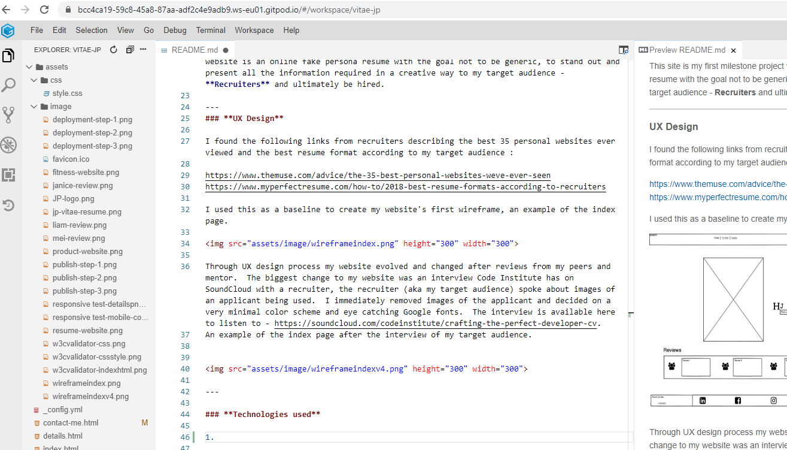

**5.** Git: It is a distributed version-control system for tracking changes in source code during software development in Gitpod. https://git-scm.com/

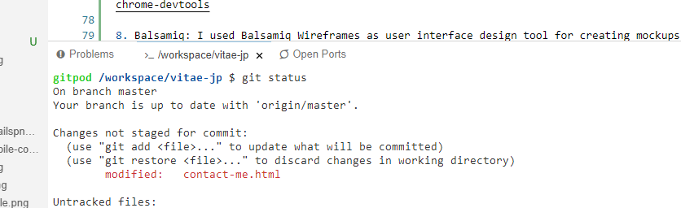

**6.** GitHub: It offers the distributed version control, that means that coders can share, collaborate and view their codes ( in my case with my mentor). https://github.

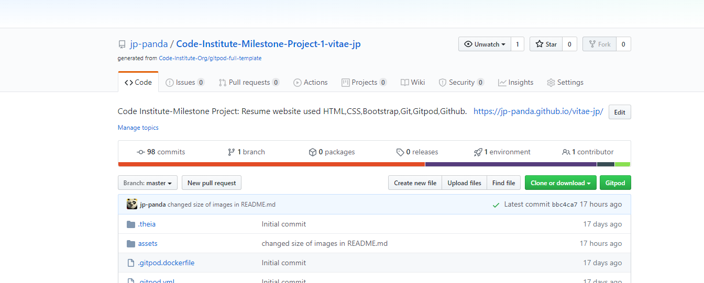

**7.** Chrome DevTools: It is a web developer tool built directly into the Google Chrome browser. I used this tool to view display on different devices, identify the elements name which I wanted to change in my CSS style page. https://developers.google.com/web/tools/chrome-devtools

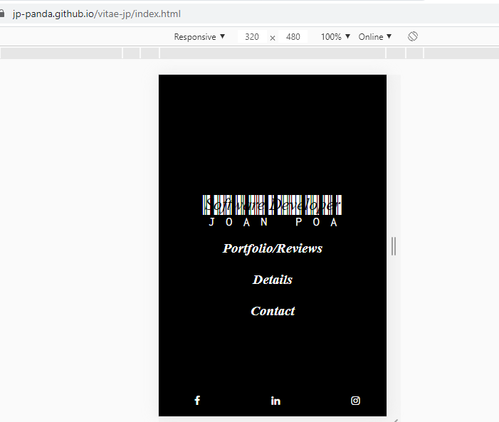

**8.** Balsamiq: I used Balsamiq Wireframes as user interface design tool for creating mockups or low-fidelity prototypes of my website. https://balsamiq.com/

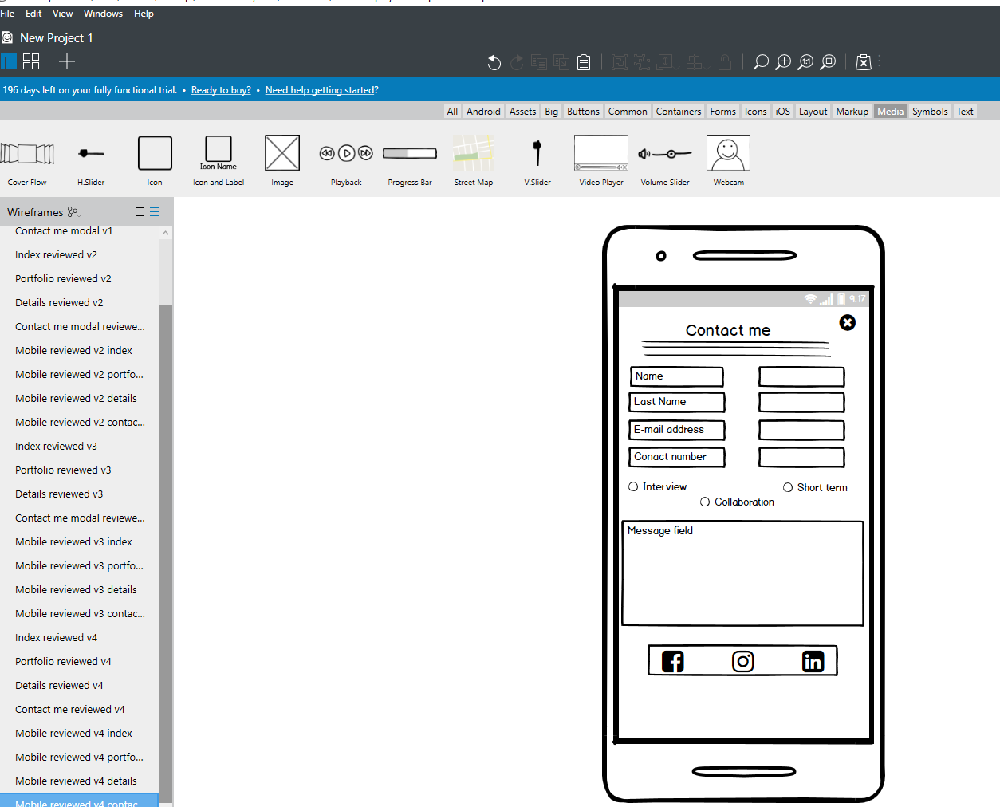

**9.** Gimp: Is a free and open-source raster graphics editor used for image retouching and editing, free-form drawing, converting between different image formats, and more specialized tasks. I used it to change coloured images to white and black. https://www.gimp.org/

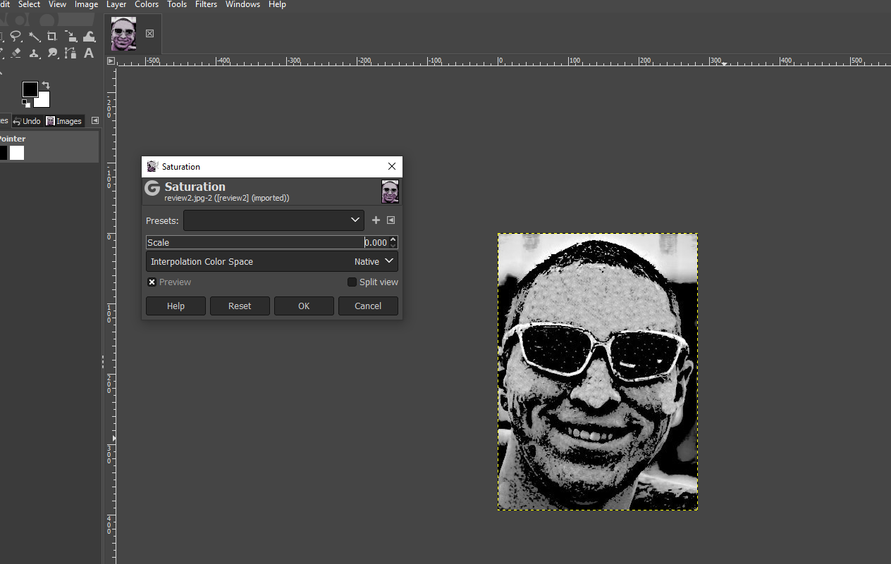

**10.** MS Paint:  Built-in application is Windows which I used to resize images to 1280px to 640px.

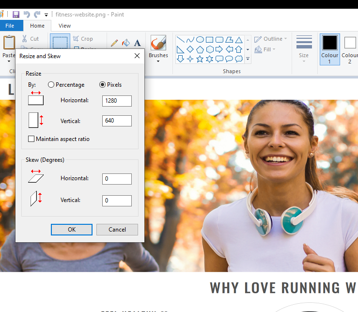

**11.** Font Awesome: I used this website for all my icons. https://fontawesome.com/

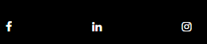

**12.** Google Fonts:  I used this website for my font styles. https://fonts.google.com/

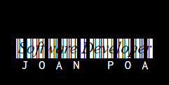

---

**Testing**

---

**1.** W3C Markup Validator: I used it to check all my html pages (4) were error free. https://validator.w3.org/ 

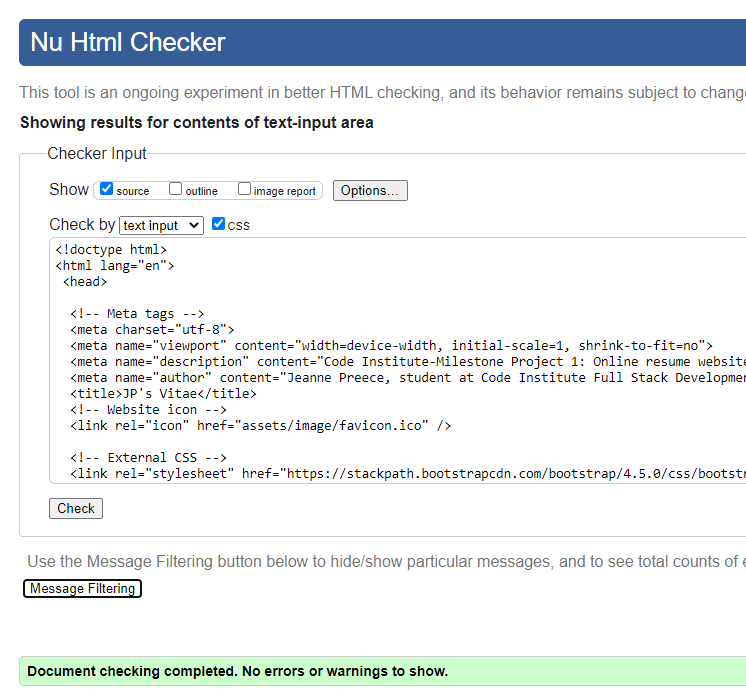

**2.** Jigsaw CSS Validor: I used it to check that my CSS style page was error free. https://jigsaw.w3.org/css-validator/validator

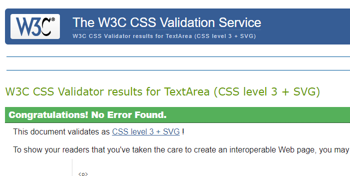

**3.** Ami Responsive Design: I used this to ensure that my website was responsive on all devices. http://ami.responsivedesign.is/ 

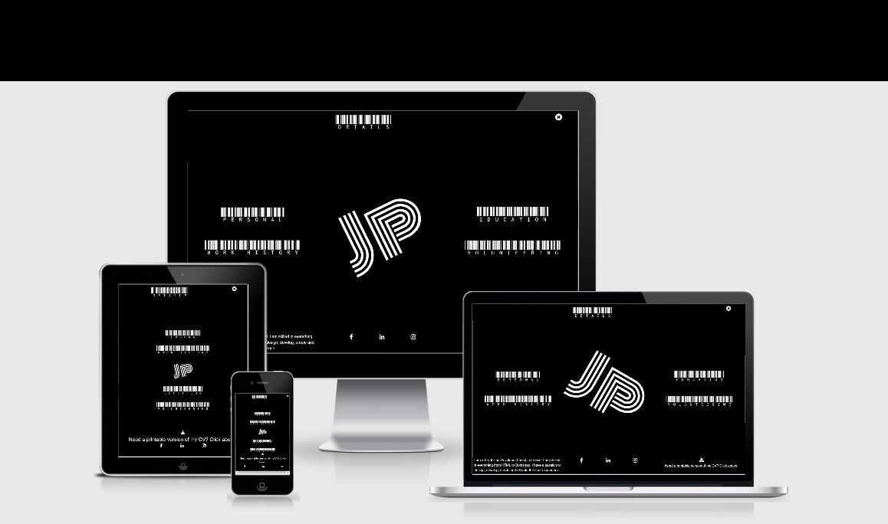
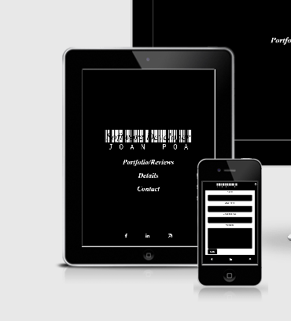

---

**Images**

---

The images I used are from Code Institute's project Love Running. 
I do not own this images, it was used for educational purposes.

http://codeinstitute.s3.amazonaws.com/FundamentalsProjects/HTML-CSS/formbg.jpg
https://codeinstitute.s3.amazonaws.com/FundamentalsProjects/HTML-CSS/video-mask.png
https://codeinstitute.s3.amazonaws.com/FundamentalsProjects/HTML-CSS/man.jpg

---

**Deployment and Publishing**

---

**1.** I signed up for a Github account.

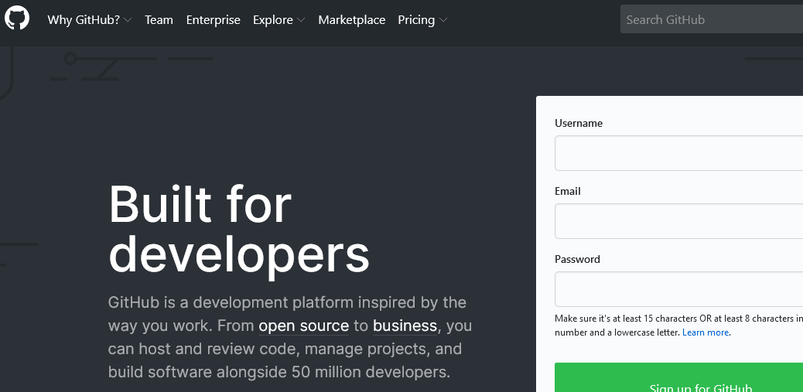

**2.** I searched for the Code Institute template and clicked on use this template.

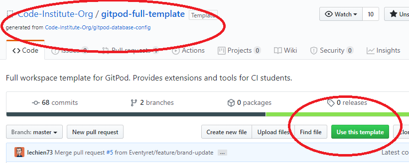

**3.** I added a name to the new repository.

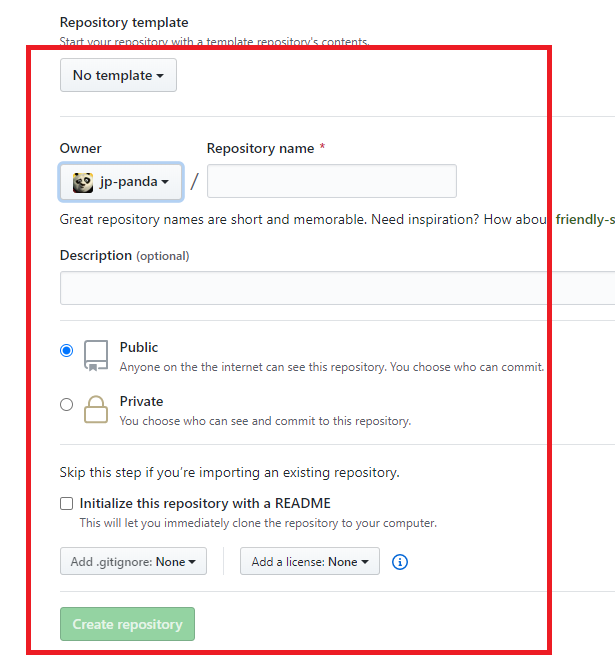

**4.** After I created the repository, I add a topic to explain what the project is about and click the Settings tab. 

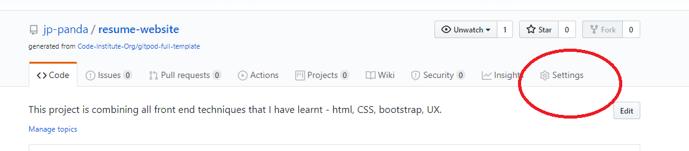

**5.** I scroll down to the Github pages section, select the master branch on the scroll menu and add a theme.  NOTE: If you do not select a theme it will not open in Gitpod. 

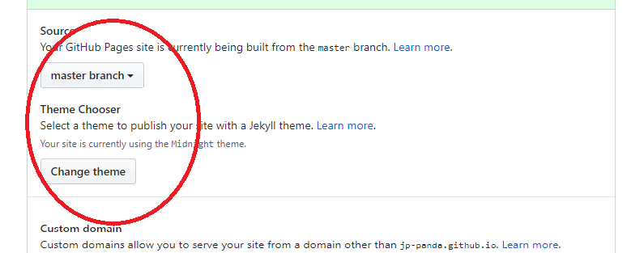

**6.**  I add Gitpod as an extension to my Github account.  (NOTE - the display says Remove from Chrome because I have already added it, it will say Add instead if you are new.)

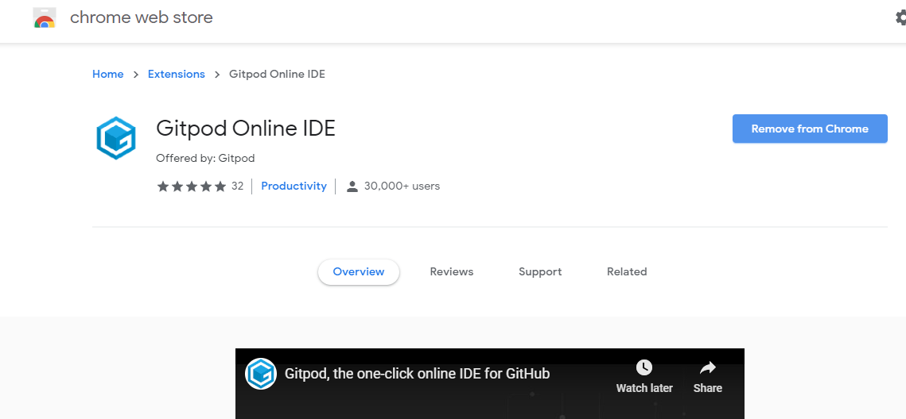

**7.**  I open the newly created repository in Gitpod.

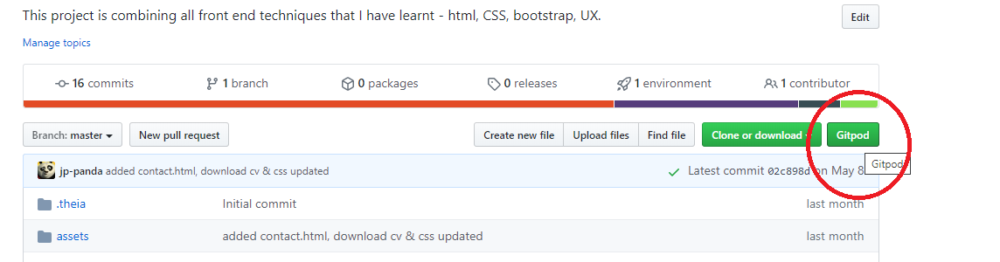

**8.** To deplay, return to the code tab (first in list) and select
Clone/Download.  Open on your desktop or download zip file to use this code which created my project.

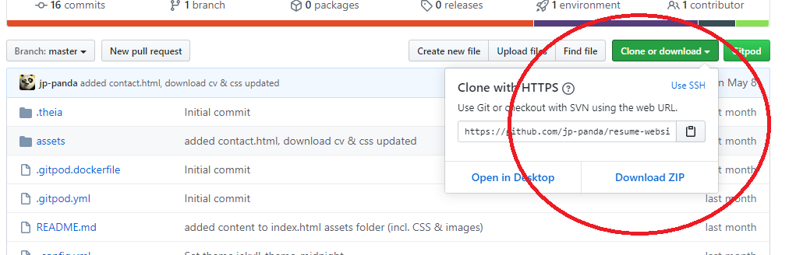

---

**Acknowledgements**

---

The StackOverflow community with helping with vertical alignment. https://stackoverflow.com/

The Code Institute's projects':
* Love Running
* Whiskey Drop
* Rosie Odenkirk resume
which really created the foundation for this website.
https://codeinstitute.net/

My mentor - Adegbenga Adeye, who really gave good advice about utilizing Bootstrap, motivated to see his students succeed.
https://ng.linkedin.com/in/adegbenga-adeye-14003635

---

**Final words**

---
## **"That's all, coders!"**

---